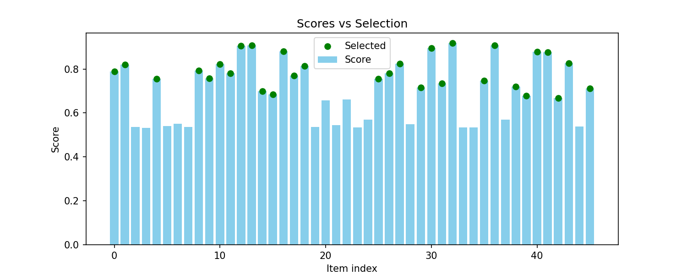
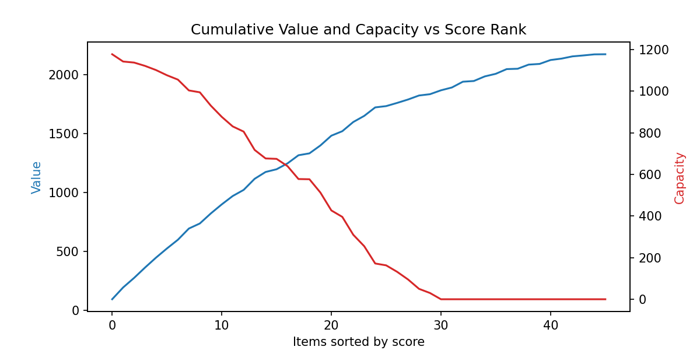
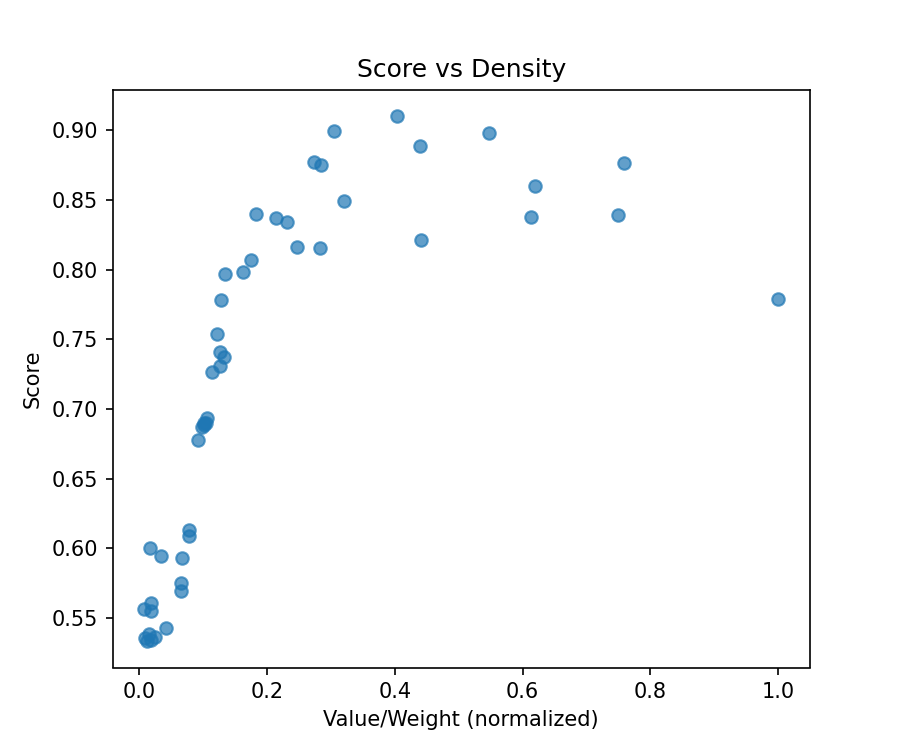
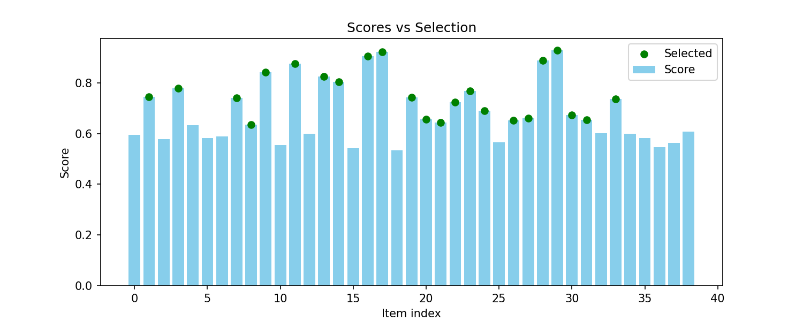
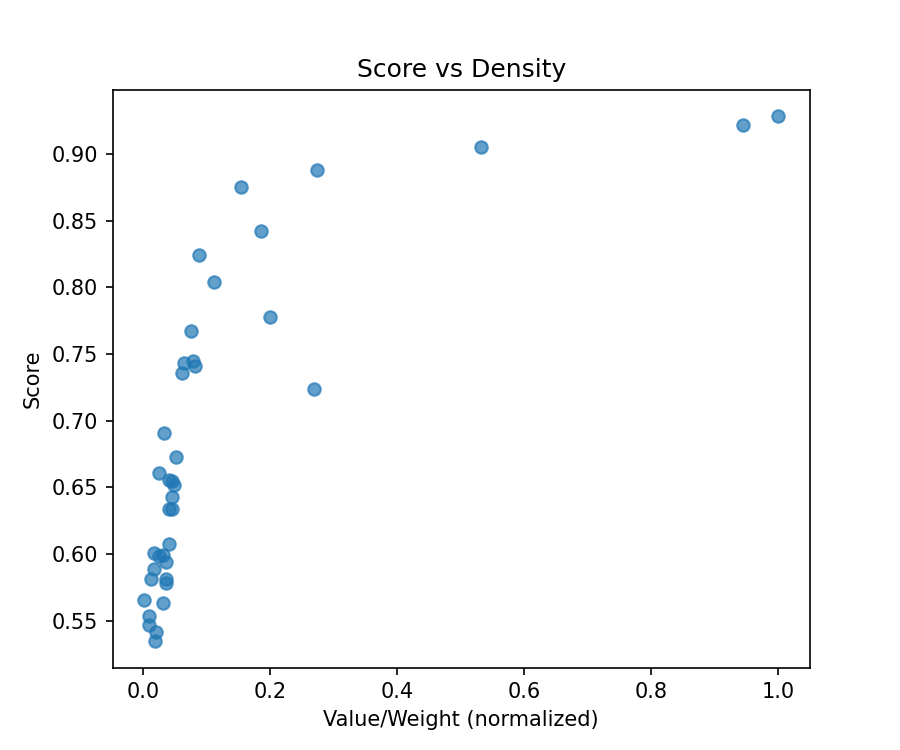
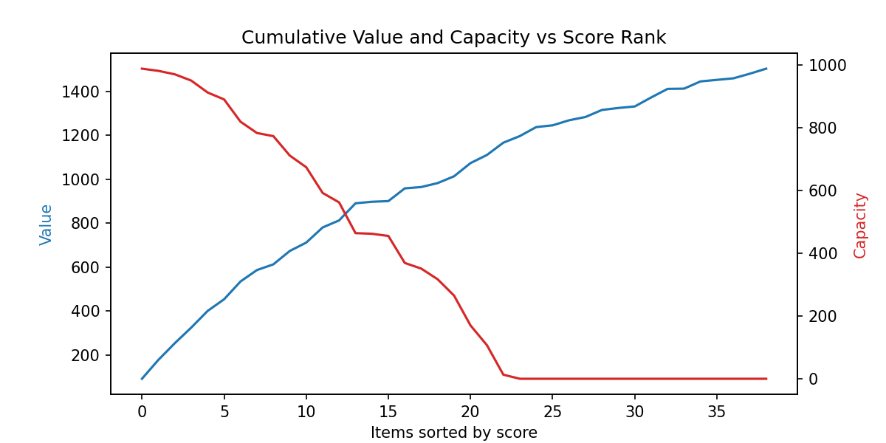

# BC Ranker Interpretability Report

*Average Spearman(score, v/w):* 0.929

## Instance 0
- Spearman(score, v/w): 0.940
- Spearman(score, value): 0.823
- Spearman(score, weight): -0.645
- Base value: 1834.00
- Capacity -5% value: 1800.00, hamming=1
- Capacity +5% value: 1891.00, hamming=2

## Instance 1
- Spearman(score, v/w): 0.936
- Spearman(score, value): 0.778
- Spearman(score, weight): -0.575
- Base value: 1993.00
- Capacity -5% value: 1945.00, hamming=3
- Capacity +5% value: 2037.00, hamming=1

## Instance 2
- Spearman(score, v/w): 0.910
- Spearman(score, value): 0.646
- Spearman(score, weight): -0.530
- Base value: 1166.00
- Capacity -5% value: 1140.00, hamming=2
- Capacity +5% value: 1196.00, hamming=1

